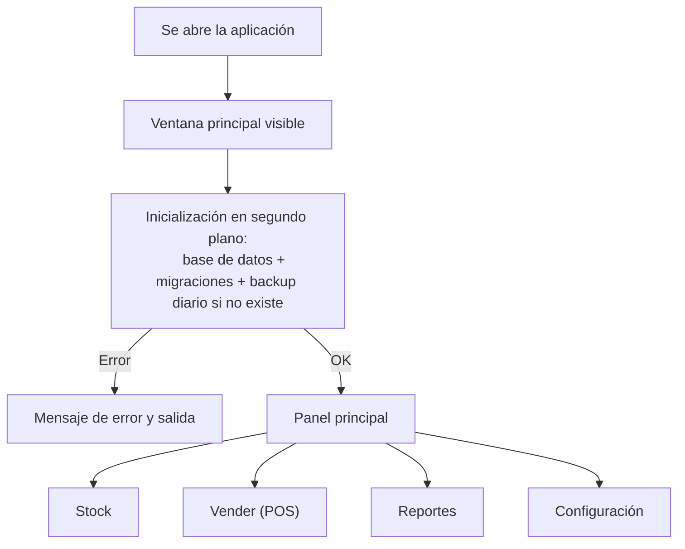
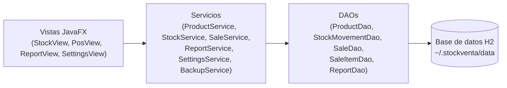
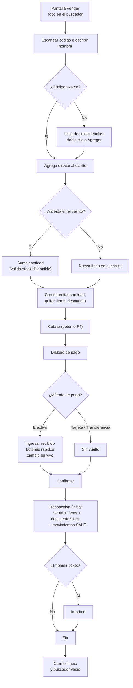
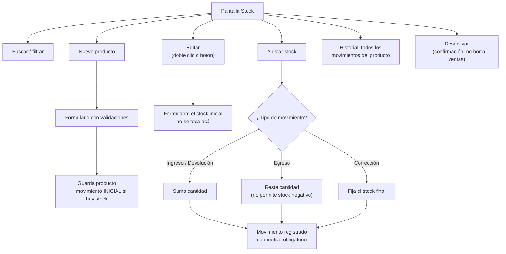
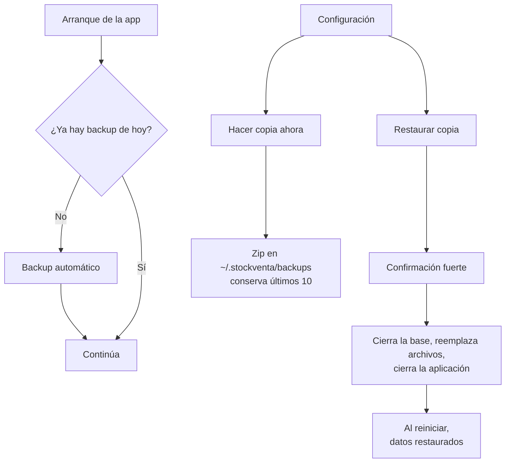

# Diagramas de flujo — Stock POS

## 1) Arranque y navegación

```mermaid
flowchart TD
    A["Se abre la aplicación"] --> B["Ventana principal visible"]
    B --> C["Inicialización en segundo plano:
    base de datos + migraciones + backup diario si no existe"]
    C -->|Error| D["Mensaje de error y salida"]
    C -->|OK| E["Panel principal"]
    E --> F["Stock"]
    E --> G["Vender (POS)"]
    E --> H["Reportes"]
    E --> I["Configuración"]
```

## 2) Arquitectura por capas

```mermaid
flowchart LR
    A["Vistas JavaFX
    (StockView, PosView, ReportView, SettingsView)"] --> B["Servicios
    (ProductService, StockService, SaleService,
    ReportService, SettingsService, BackupService)"]
    B --> C["DAOs
    (ProductDao, StockMovementDao, SaleDao,
    SaleItemDao, ReportDao)"]
    C --> D[("Base de datos H2
    ~/.stockventa/data")]
```

## 3) Flujo de venta (Punto de Venta)

```mermaid
flowchart TD
    A["Pantalla Vender
    foco en el buscador"] --> B["Escanear código o escribir nombre"]
    B --> C{"¿Código exacto?"}
    C -->|Sí| D["Agrega directo al carrito"]
    C -->|No| E["Lista de coincidencias:
    doble clic o Agregar"]
    E --> D
    D --> F{"¿Ya está en el carrito?"}
    F -->|Sí| G["Suma cantidad
    (valida stock disponible)"]
    F -->|No| H["Nueva línea en el carrito"]
    G --> I["Carrito: editar cantidad,
    quitar items, descuento"]
    H --> I
    I --> J["Cobrar (botón o F4)"]
    J --> K["Diálogo de pago"]
    K --> L{"¿Método de pago?"}
    L -->|Efectivo| M["Ingresar recibido
    botones rápidos
    cambio en vivo"]
    L -->|Tarjeta / Transferencia| N["Sin vuelto"]
    M --> O["Confirmar"]
    N --> O
    O --> P["Transacción única:
    venta + items + descuenta stock
    + movimientos SALE"]
    P --> Q{"¿Imprimir ticket?"}
    Q -->|Sí| R["Imprime"]
    Q -->|No| S["Fin"]
    R --> S
    S --> T["Carrito limpio
    y buscador vacío"]
```

## 4) Flujo de stock

```mermaid
flowchart TD
    A["Pantalla Stock"] --> B["Buscar / filtrar"]
    A --> C["Nuevo producto"]
    C --> C1["Formulario con validaciones"]
    C1 --> C2["Guarda producto
    + movimiento INICIAL si hay stock"]
    A --> D["Editar
    (doble clic o botón)"]
    D --> D1["Formulario: el stock inicial
    no se toca acá"]
    A --> E["Ajustar stock"]
    E --> F{"¿Tipo de movimiento?"}
    F -->|Ingreso / Devolución| G["Suma cantidad"]
    F -->|Egreso| H["Resta cantidad
    (no permite stock negativo)"]
    F -->|Corrección| I["Fija el stock final"]
    G --> J["Movimiento registrado
    con motivo obligatorio"]
    H --> J
    I --> J
    A --> K["Historial: todos los
    movimientos del producto"]
    A --> L["Desactivar
    (confirmación, no borra ventas)"]
```

## 5) Backups y restauración

```mermaid
flowchart TD
    A["Arranque de la app"] --> B{"¿Ya hay backup de hoy?"}
    B -->|No| C["Backup automático"]
    B -->|Sí| D["Continúa"]
    C --> D
    E["Configuración"] --> F["Hacer copia ahora"]
    F --> G["Zip en ~/.stockventa/backups
    conserva últimos 10"]
    E --> H["Restaurar copia"]
    H --> I["Confirmación fuerte"]
    I --> J["Cierra la base, reemplaza archivos,
    cierra la aplicación"]
    J --> K["Al reiniciar,
    datos restaurados"]
```
